# DevHive

DevHive is the social network solution for programmers. In it you can make posts to share with your friends, comment and more.

This is the back-end portion of the project, built with [`Angular`](https://angular.io/). For the back-end, refer to [DevHive](https://github.com/Team-Kaleidoscope/DevHive).

In the `docs` folder you can find relevenat information and documentation about this project. You can also find our Privacy Policy.

## Contents:
- [Setting up locally](#setting-up-locally)
  - [Prerequisites](#prerequisites)
  - [Starting up](#starting-up)
  - [Important notes](#important-notes)
- [Screenshots](#screenshots)

## Setting up locally

### Prerequisites

You'll need to install the following tools:
- [`Angular CLI 11.0.6`](https://www.tecmint.com/install-angular-cli-on-linux/) or greater (older versions might work, but haven't been tested)

### Starting up

1. Clone the repository: `git clone https://github.com/Team-Kaleidoscope/DevHive.git`
2. Navigate to the folder, in which you cloned it
3. Run `npm install` to install all front-end packages
4. Run `ng serve` to start up the front-end
   - as with the API, you can [run the command in background](https://linuxize.com/post/how-to-run-linux-commands-in-background/) or [create a systemd service](https://medium.com/@benmorel/creating-a-linux-service-with-systemd-611b5c8b91d6)

If everything went smoothly, you will be able to access the front-end from `http://localhost:4200`. Also, don't forget that the API needs to be running *at the same time*, otherwise you won't get beyond the Login and Register pages!

### Important notes

If you host your API on a specific link that isn't the standard `http://localhost:5000`, go to `src/app` and edit the `app-constants.module.ts` file, on the second row you're gonna see the variable `BASE_API_URL`, update it.

You can change on what port the front-end is ran, by issuing the serve command with the `--port` parameter: `ng serve --port 5001`. But, **don't run it with the `--ssl` parameter!** SSL isn't supported yet and you'll have issues trying to use it! If you really need ssl, using a [reverse proxy](https://www.cloudflare.com/learning/cdn/glossary/reverse-proxy/) might be a viable alternative.

## Screenshots

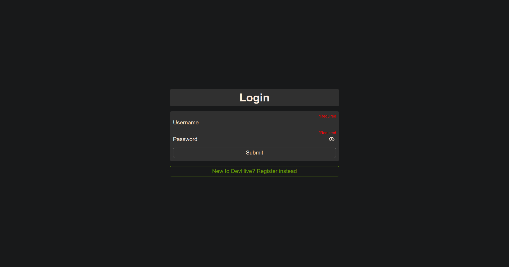
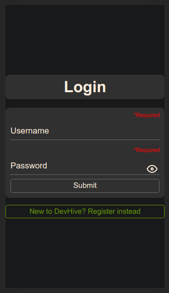
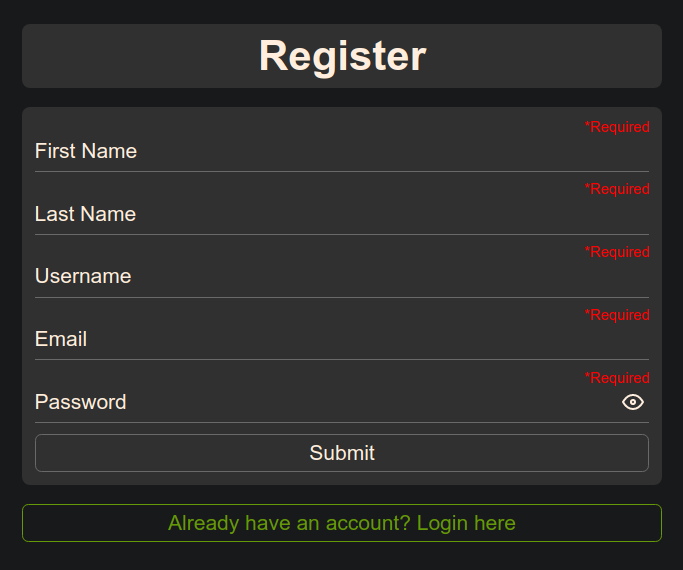
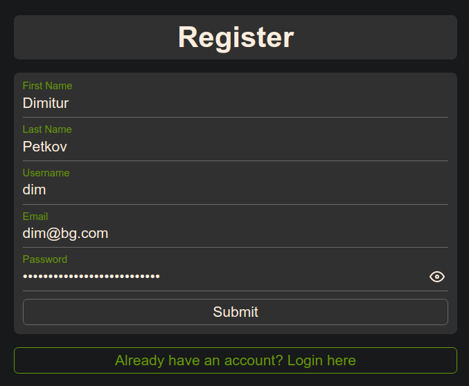
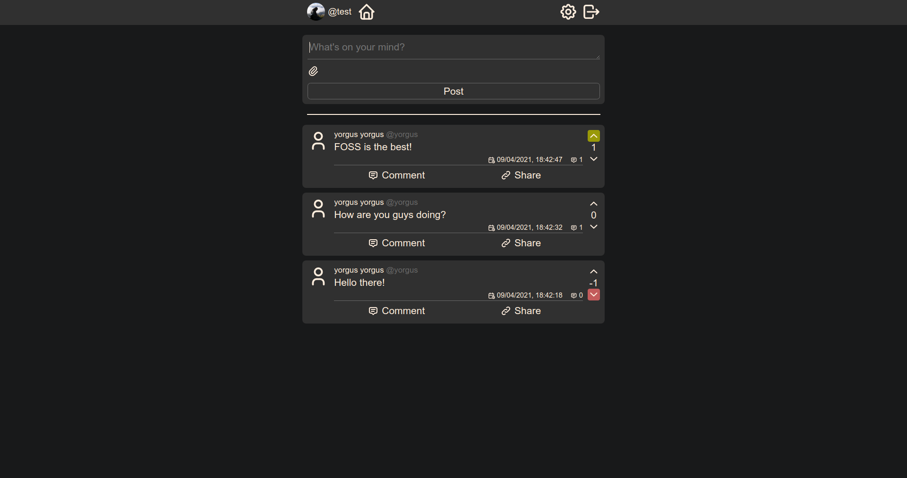
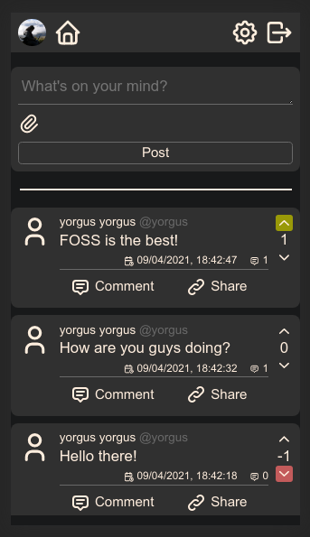
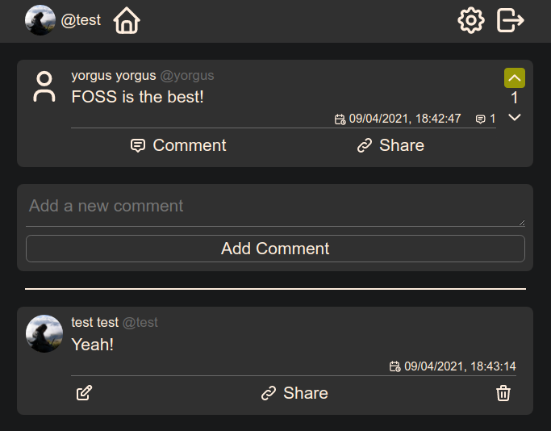
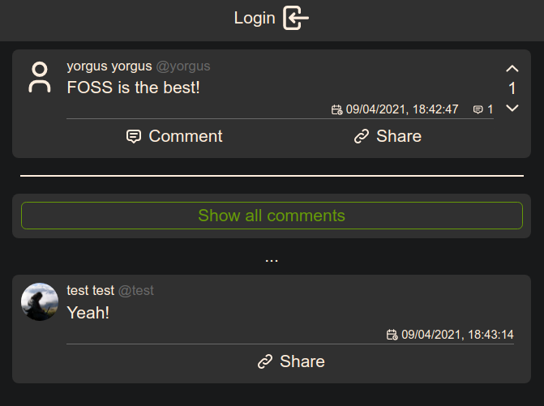
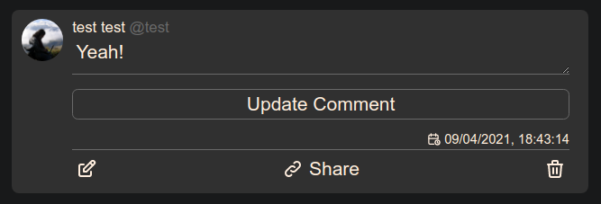
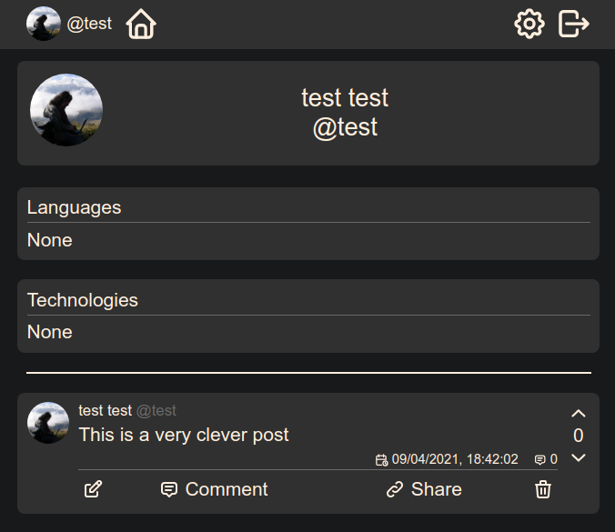
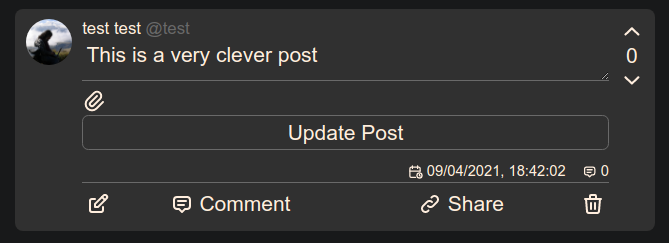
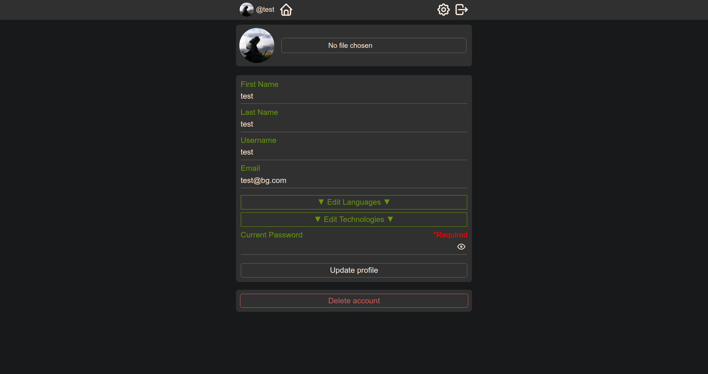
